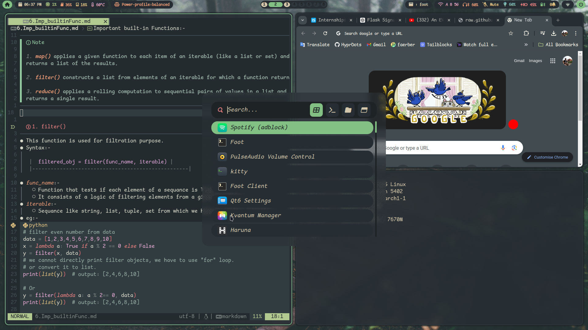
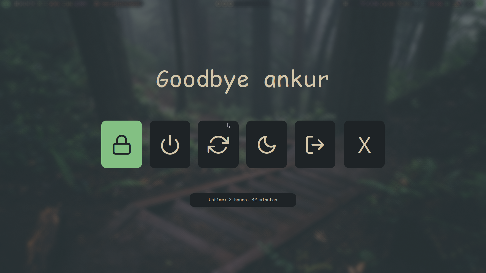

# Hyprland Dotfiles
This is my [ Hyprland ](https://github.com/hyprwm/Hyprland.git) dot files which is customized for *simplicity*.

- Hyprland

- Menu

- powerMenu

## Utilities
- StatusBar - [waybar](https://github.com/Alexays/Waybar.git)
- Applets & Menu - Rofi [ [wayland fork] ](https://github.com/lbonn/rofi.git)
- Editor - [ Neovim ](https://github.com/neovim/neovim.git)
- Terminal - [Foot](https://codeberg.org/dnkl/foot.git), [Kitty](https://github.com/kovidgoyal/kitty.git)
- FileManager - [Pcmanfm-gtk3](https://github.com/kovidgoyal/kitty.git)
- Wallpaper-engine - [Swww](https://github.com/LGFae/swww.git)

## Themes
- **Dracula**
- **Gruvbox**
- **Everforest**
- **TokyoNight**

> [!NOTE]
>
> For changing Themes click `alt` + `SHIFT` + `t`, a rofi menu will appear where u > can change your themes.
>
> For changing Wallpaper simply press `Super` + `w`, and select from the options.

